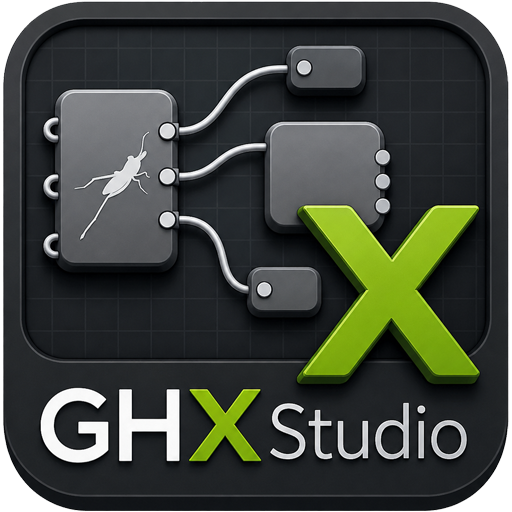

# GHX Studio 🚀
**DevTools for Grasshopper. Advanced performance profiling, static analysis, and visual debugging.**

GHX Studio is an enterprise-grade developer tool (DevTool) built to make Grasshopper parametric design measurable, debuggable, and significantly faster. It brings "Chrome DevTools" like capabilities directly into the Rhinoceros/Grasshopper environment.

## ✨ What's New in v2.0 (Major Update)
* **⏱️ Statistical Benchmarking & GC Profiler:** Run your graph asynchronously 10x times. GHX Studio filters out OS noise to provide the *True Mean Solve Time* and explicitly tracks .NET Garbage Collection to detect hidden **Memory Leaks** in custom C#/Python scripts.
* **✨ Visual Error Flow:** Tracing downstream errors now draws a glowing neon path directly on your Grasshopper canvas, highlighting the exact error flow from the root cause to the affected nodes.
* **📜 Custom JSON Rulesets:** BIM Managers can now load custom `.json` files to enforce company-wide Linter rules (e.g., maximum execution times, forbidden components).
* **🌘 Rhino 9 Dark Mode Support:** Native UI integration featuring dynamic luminance detection for seamless Dark Mode compatibility in Rhino 9 Beta.

## 🛠️ Core Features
* **🔴 Canvas Heatmap:** Real-time visual overlay on the Grasshopper canvas highlighting performance bottlenecks.
* **🔍 Smart Debugger:** Deep inspection of Data Trees to find nulls, empty branches, and trace errors upstream/downstream without manual wire-checking.
* **🤖 Static Analysis (Linter):** Evaluates nodes against deterministic rules to warn you about bad practices and memory vulnerabilities.
* **📊 Export Reports:** Generate comprehensive HTML, JSON, or CSV reports for BIM managers and computational teams.
* **⚡ Universal Architecture:** Built specifically for Rhino 8 & 9 (.NET 8). Fully functional on Grasshopper 1. 

> **⚠️ Note on Grasshopper 2 (WIP) Support:** 
> The architecture for GH2 is structurally staged using dynamic late-binding to prevent crashes. However, because the official McNeel GH2 Kernel API is currently sealed/undocumented in the WIP phase, **GH2 live telemetry is temporarily dormant**. The adapter is ready and will be automatically activated in a future release as soon as the official SDK drops!

## 📥 Installation (For Users)
1. Go to the [Releases](../../releases) page.
2. Download the latest `GHXStudio.Core.rhp` file.
3. Drag and drop the `.rhp` file into your active Rhino window.
4. Type `GHXStudio` in the Rhino command line to launch the dashboard.

## 💻 Build from Source (For Developers)
To respect McNeel's EULA, proprietary Grasshopper 2 WIP libraries are excluded from this repository. To build the project locally:
1. Clone the repository.
2. Create a folder named `Libs` inside the `GHXStudio.Core` directory.
3. Copy `Grasshopper2.dll` from your local AppData package cache (`%appdata%\McNeel\Rhinoceros\packages\8.0\Grasshopper2\...\net48\`) into the `Libs` folder.
4. Run `dotnet build -c Release`.

## 👨‍💻 Author
**Mohammad Amin Moradi**
* LinkedIn: [moaminmo90](https://www.linkedin.com/in/moaminmo90)
* GitHub: [@moaminmo90](https://github.com/moaminmo90)

## 📄 License
This project is licensed under the MIT License - see the [LICENSE](LICENSE) file for details.